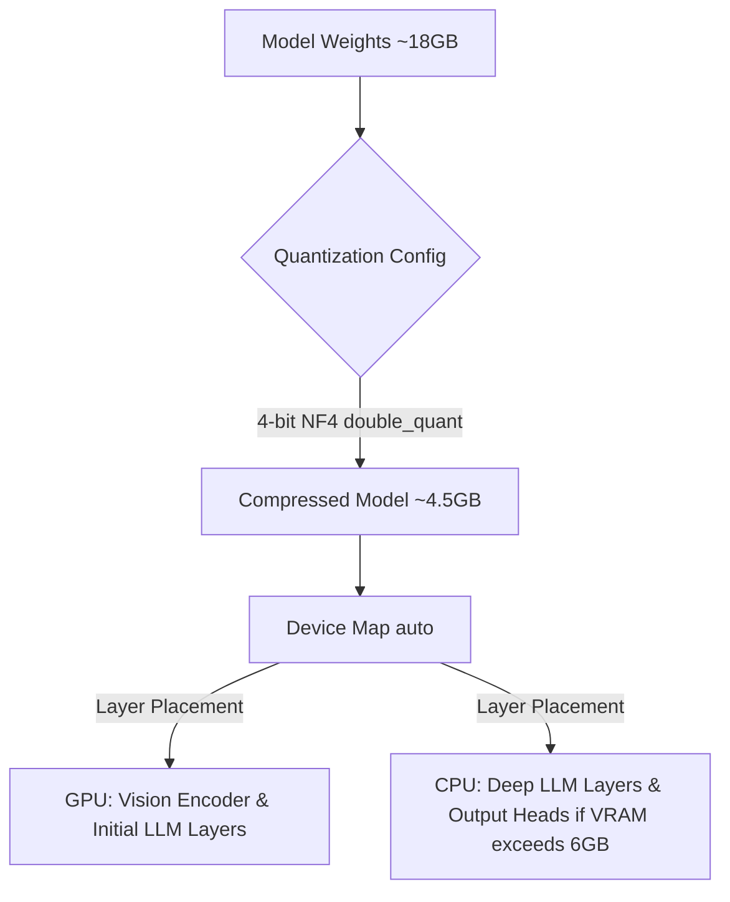

# InternVideo2 GPU/CPU Offloading Strategy Report

This report outlines the memory conservation and layer distribution strategy for running the InternVideo2 model on an 8 GB VRAM GPU.

## 1. Core Offloading Architecture

We employ PyTorch and Hugging Face's `accelerate` library to handle automatic layer placement and quantization.

## 2. Quantization Parameters

To run within 8 GB VRAM, we instantiate the model with `bitsandbytes` 4-bit Normal Float (NF4):
- **load_in_4bit**: `True`
- **bnb_4bit_quant_type**: `"nf4"`
- **bnb_4bit_use_double_quant**: `True` (quantizes the quantization constants to save an extra ~0.4 bits per parameter)
- **bnb_4bit_compute_dtype**: `torch.float16` (ensures fast FP16 tensor core math during forward pass)

## 3. Dynamic Offloading Plan

1. **VRAM Target**: Keep total VRAM utilization under **7.5 GB** to prevent OS desktop environments or background tasks from triggering CUDA OOMs.
2. **Device Map**: Setting `device_map="auto"` automatically estimates the VRAM capacity and assigns the initial blocks of the model to the GPU. The remaining blocks are automatically mapped to CPU memory (`cpu` or `disk` offloading).
3. **Execution Routing**: High-overhead layers (such as early layers and the vision encoder) remain on the GPU, while deep decoder blocks can execute on the CPU if VRAM limits are crossed.
