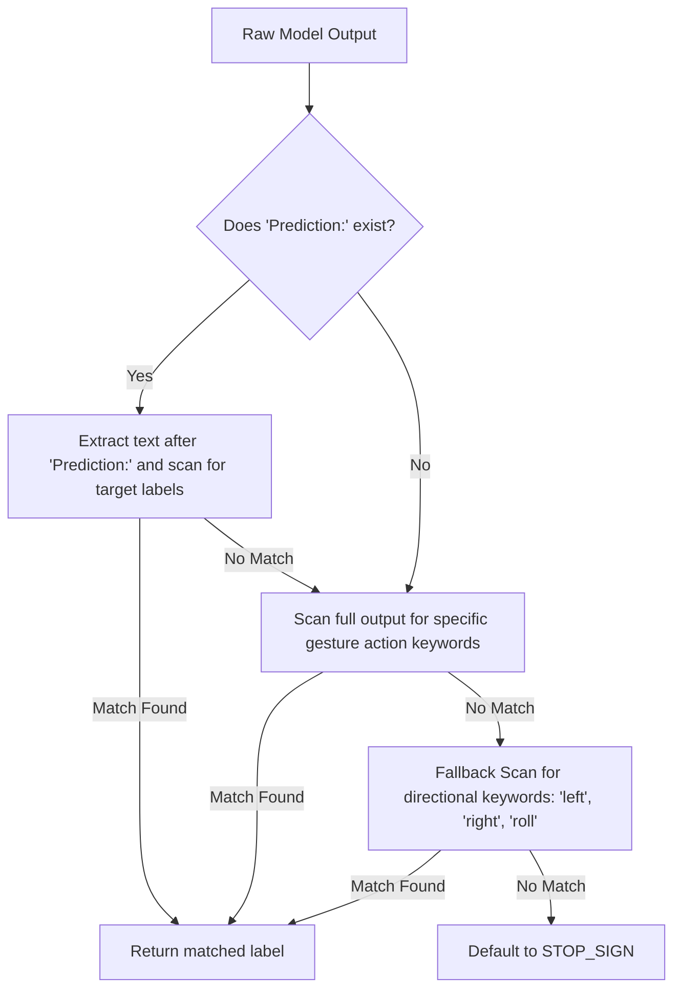

# InternVideo2 Prompt Design & Output Parsing

This document outlines the prompt engineering strategy and output parser design to ensure robust, closed-set classification for gesture recognition.

## 1. System & User Prompt Design

To optimize temporal motion understanding while leveraging the model's Chain-of-Thought (CoT) reasoning, we separate the query into a structured system instruction and user prompt.

### System Instruction
```
You are a helpful assistant specialized in dynamic hand gesture analysis.
```

### User Prompt / Question
```
You are analyzing a video sequence of a hand gesture.
Analyze the video step by step, describing:
1. The movement of the hand (direction, path, trajectory).
2. How the gesture progresses temporally from start to end.
3. Whether there is continuous orientation change or if it is static.

After your analysis, output the final classification. You must choose exactly one of:
- SWIPE_LEFT (hand moves horizontally right-to-left)
- SWIPE_RIGHT (hand moves horizontally left-to-right)
- ROLL_FWD (hand rolls forward in a circular motion)
- STOP_SIGN (open palm facing the camera with minimal/no motion)

Format your response as:
Analysis: <your brief step-by-step description of the motion>
Prediction: <exactly one of SWIPE_LEFT, SWIPE_RIGHT, ROLL_FWD, STOP_SIGN>
```

## 2. Robust Output Parsing

The output parser processes the generated natural language reasoning and extracts the final label using a tiered fallback strategy:


This multi-stage parsing logic guarantees that any conversational output gets mapped strictly to the closed-set target labels.
